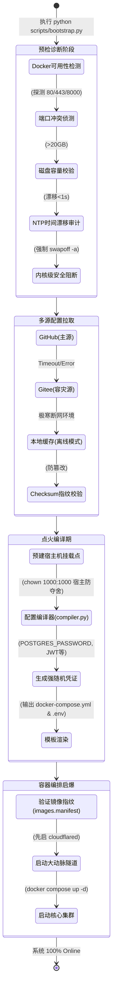
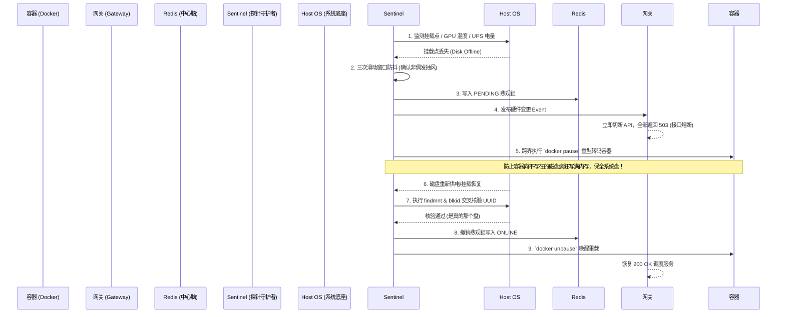

# ZEN70 V2.0 图形化部署与点火引擎指南

本指南详细剖析了 ZEN70 系统从裸机环境（Zero-to-Hero）到全栈服务上线的“点火（Bootstrap）”与“编译（Compile）”流程。

我们摒弃了传统繁琐的人工环境配置，采用 `scripts/bootstrap.py` 作为统一入口，利用配置编译器自动生成 Docker 环境。

## 部署核心流程全景图

下图展示了从触发部署到最终微服务群体上线的全生命周期节点：



---

## IaC 配置流式转换架构 (Schema Pipeline)

由于 ZEN70 遵守配置与环境“绝对解耦”原则，我们通过编译环节动态映射所有机密凭证。以下为配置渲染引擎的数据流向：

```mermaid
graph TD
    A[system.yaml (唯一声明式事实)] -->|读取配置拓扑| C(scripts/compiler.py)
    B[系统环境变量 (OS Env)] -->|注入现有令牌| C
    E[预置密钥库 (.env)] -.->|读取持久化密码| C

    C -->|分析并动态补全缺失密码 (32位高强随机)| F[凭证熔炉 (Secret Generator)]
    F -->|输出变量安全字典| C
    
    C -->|渲染 Jinja2 引擎| D1((docker-compose.yml))
    C -->|渲染 Jinja2 引擎| D2((.env 运行时变体))
    
    D1 --> G[Docker Compose Runtime]
    D2 --> G
    
    subgraph Jinja 模板底库
        T1(docker-compose.yml.j2)
        T2(.env.j2)
    end
    T1 -.-> C
    T2 -.-> C

    style C fill:#0ea5e9,stroke:#0284c7,stroke-width:2px,color:white
    style G fill:#10b981,stroke:#059669,stroke-width:2px,color:white
```

---

## 防脑裂探针接管拓扑层 (Sentinel Topology)

系统拉起后，探针 `Topology Sentinel` 将实时守卫星系级的底层 I/O 与温度状态：



## 极速起飞指令

**前置依赖**：一台运行现代 Linux 发行版（如 Debian 12 / Ubuntu 22.04）并安装了 Docker 的宿主机。

```bash
# 仅仅一行命令即可点火整个航母战斗群
sudo python3 scripts/bootstrap.py
```
